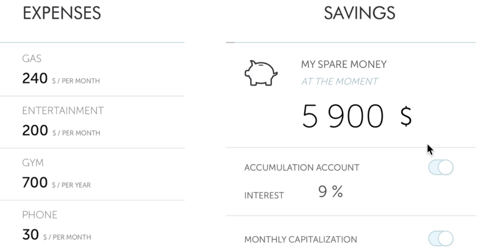
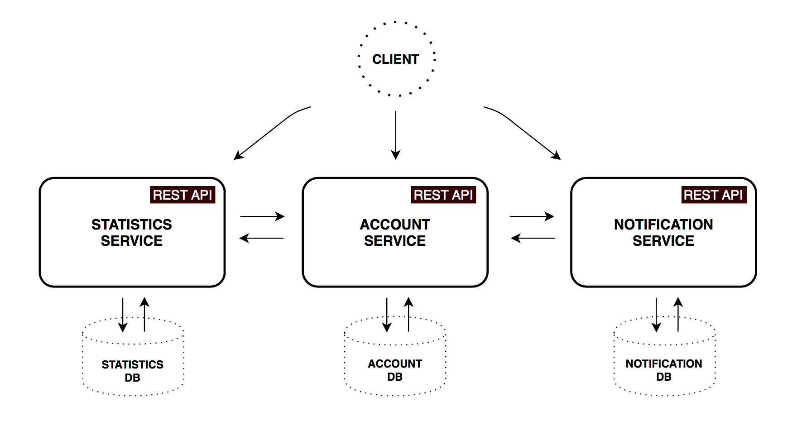
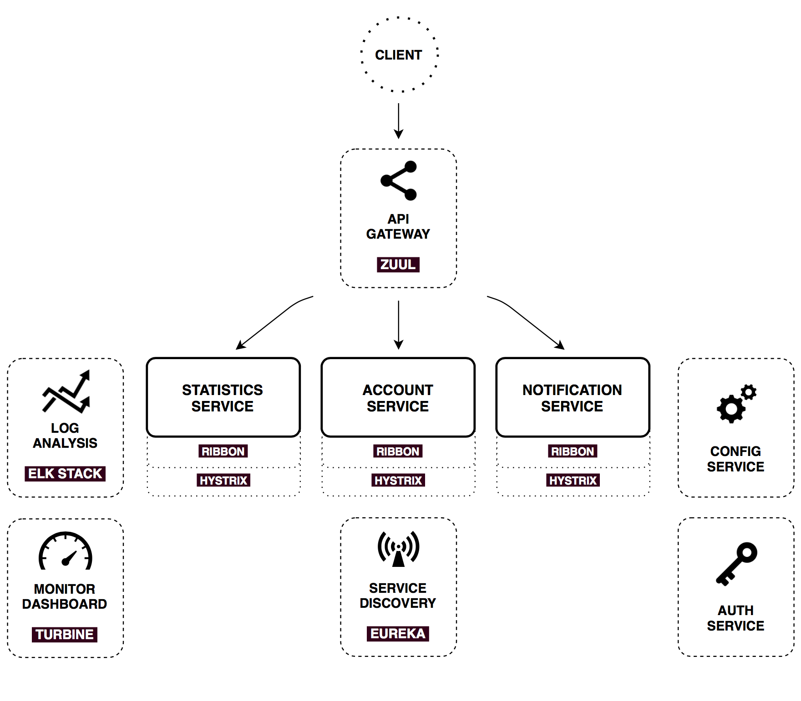
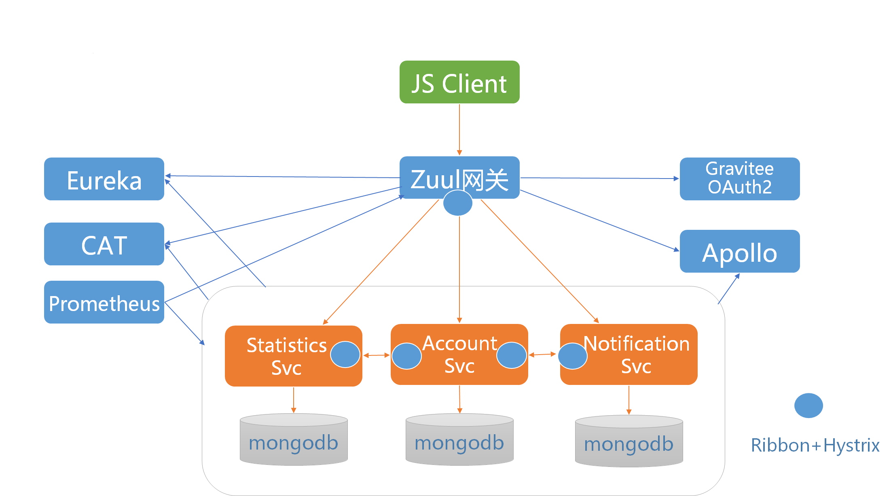
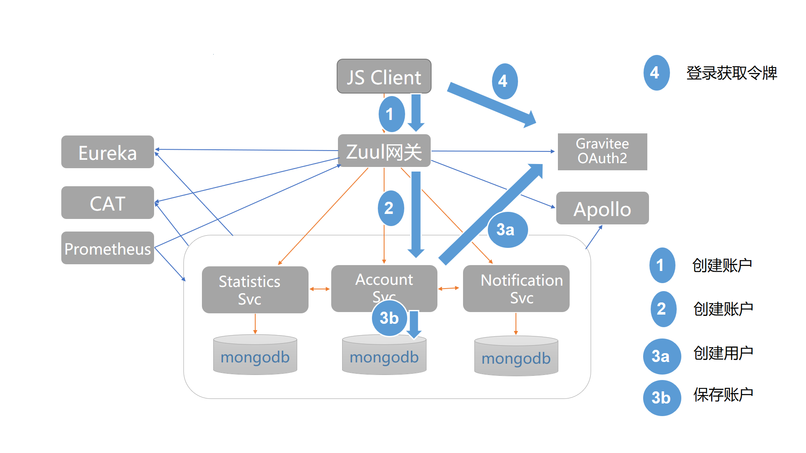
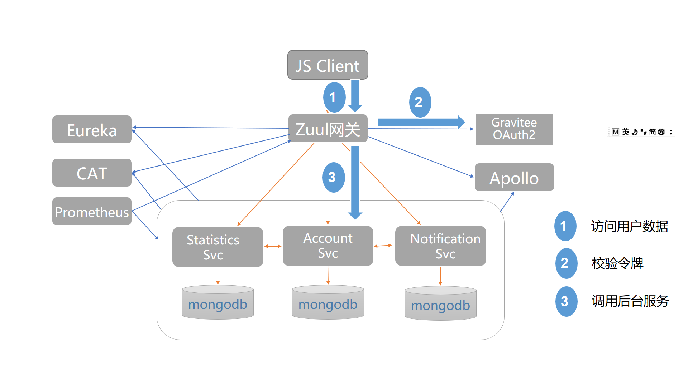

## 介绍

本项目是课程《微服务架构和实践160讲》的综合案例分析项目，将会通过一个简单的模拟业务案例，将之前课程的各个组件集成起来，包括：

* 统一授权认证中心Gravitee OAuth2
* 集中配置Apollo
* 基础服务Zuul/Eureka/Ribbon/Hystrix
* 监控反馈CAT/Prometheus

这些组件既包括Spring Cloud技术栈的部分组件(Zuul/Eureka/Ribbon/Hystrix)，也包含国内一线互联网公司落地的一些组件(如大众点评CAT和携程Apollo)，也包括为课程开发的组件[Gravitee OAuth2](https://github.com/spring2go/gravitee)(非生产级)，所以本案例可以称为是一个中国式微服务技术栈综合演示案例，可供学习参考。

另外，课程开播以来陆续收到一些学员的提问，比较典型的有：

* 如何使用Apollo集中管理Spring应用的配置？
* 网关集中验证令牌怎么做？
* 基于OAuth2的注册登录和API调用具体如何实现？
* CAT非侵入式埋点怎么做，如何尽量减少业务研发直接使用CAT进行埋点？

在课程中，通过案例演示，我也会统一回复这些问题。

## 案例背景

我本人并不打算完全自己开发一个演示案例，而是会重用比较流行的开源项目，在它基础上做定制扩展，所以本案例是基于github上的一个开源项目[PiggyMetrics](https://github.com/sqshq/PiggyMetrics)改造而来。PiggyMetrics是一个模拟的个人记账理财的应用，原作者称其为一个端到端的微服务PoC(Proof of Concept)，也就是说他开发这个是为了验证微服务架构和Spring Cloud技术栈。PiggyMetrics目前在github上有超过4.6k星，是学习微服务架构和Spring Cloud技术栈的一个不错参考。

PiggMetrics采用前后分离架构，前端是单页SPA，后端采用基于Spring Cloud技术栈的微服务架构。

## 架构设计

### 业务服务架构

上图是PiggyMetrics的业务服务架构，包括：

1. **CLIENT**，一个纯JS/HTML/CSS单页应用，实现注册登录和前端展示逻辑
2. **ACCOUNT SERVICE**，账户服务，存储用户账户和记账信息
3. **NOTIFICATION SERVICE**，通知服务，存储通知和备份等相关配置
4. **STATISTICS SERVICE**，统计服务，计算用户财务状况和统计信息

每个服务有一个独立的MongoDB数据存储(表示微服务独立数据源思想)。客户端可调用后台服务，例如前端调用账户服务去注册账户。服务之间也会相互调用，例如账户更新时，账户服务会同时调统计服务去更新用户统计信息。另外，统计服务还会调用第三方汇率服务获取汇率信息。

### 原基础服务架构

上图是PiggyMetrics的原基础服务架构，包括：

1. **API网关**:基于**Spring Cloud Zuul**的网关，是调用后台API的聚合入口，实现反向路由和负载均衡(Eureka+Ribbon)、限流熔断(Hystrix)等功能。CLIENT单页应用和ZUUL网关暂住在一起，简化部署。
2. **服务注册和发现**:基于**Spring Cloud Eureka**的服务注册中心。业务服务启动时通过Eureka注册，网关调用后台服务通过Eureka做服务发现，服务之间调用也通过Eureka做服务发现。
3. **授权认证服务**:基于**Spring Security OAuth2**的授权认证中心。客户端登录时通过AUTHSERVICE获取访问令牌(走用户名密码模式)。服务之间调用也通过AUTHSERVICE获取访问令牌(走客户端模式)。令牌校验方式~各资源服务器去AUTHSERVICE集中校验令牌。
4. **配置服务**:基于**Spring Cloud Config**的配置中心，集中管理所有Spring服务的配置文件。
5. **分布式调用链**：基于**Spring Cloud Sleuth**的调用链监控。网关调用后台服务，服务之间调用，都采用Zipkin进行埋点和跟踪。
6. **软负载和限流熔断**:基于**Spring Cloud Ribbon&Hystrix**，Zuul调用后台服务，服务之间相互调用，都通过Ribbon实现软负载，也通过Hystrix实现熔断限流保护。
7. **METRICS & DASHBOARD**:基于**Spring Cloud Turbine + Hystrix Dashboard**，对所有Hystrix产生的Metrics流进行聚合，并展示在Hystrix Dashboard上。
8. **日志监控**:采用**ELK**栈集中收集和分析应用日志。

### 改造后的基础服务架构

上图是经过我改造后的架构，浅蓝色标注的都属于基础服务，主要替换的组件如下：

1. **授权认证服务**：替换为使用第8模块为课程定制开发的**Gravitee OAuth2**服务器。
2. **配置服务**：替换为使用携程**Apollo**做统一配置中心，集中管理所有Spring微服务的配置。
3. **分布式调用链**:替换为使用大众点评开源的**CAT**做调用链监控，从网关调后台服务，服务之间相互调用，都采用CAT客户端进行埋点监控。CAT埋点既演示使用拦截器(interceptor)方式，也演示使用AOP非侵入方式。
4. **METRICS&ALERTING**：网关和微服务都启用Prometheus Metrics端点，便于集成**Prometheus**监控和告警。

其它组件，比如**Zuul**网关、**Eureka**服务发现、**Ribbon**软负载、**Hystrix**限流熔断，以及**ELK**集中日志都同原架构，没有太大变化。 

## 注册登录和服务调用流程

### 注册登录流程

上图展示PiggyMetrics的登录注册流程，简化流程如下：

1. 客户端应用向后台发起注册请求。
2. 请求通过网关反向路由到账户服务(Account Svc)。
3. 账户服务先去授权认证服务(Gravitee OAuth2)创建一个用户(包括用户和密码，这样后续才可以登录获取访问令牌)。账户服务再保存新账户信息到本地MongoDB数据库。
4. 注册成功以后，客户应用向授权认证服务请求访问令牌(走用户名密码模式)，拿到令牌以后缓存本地localstorage。

### 服务调用流程

上图展示PiggyMetrics的API调用流程，简化流程如下：

1. 客户端向后台服务发起API调用，调用时在HTTP授权头上带上访问令牌
2. 网关截获API请求，根据安全需求判断是否需要验令牌，如果需要，则向授权服务器发起令牌校验请求。授权服务器校验令牌并返回有效型性信息，如果令牌有效，同时返回用户名等相关信息。网关再判断校验是否通过，如果通过，则**将用户名以HTTP HEADER方式向后台服务传递**，如果不通过，则直接报授权错到客户端。
3. 资源服务器从HTTP HEADER获取用户名等信息，可通过用户名进一步查询用户相关信息，实现业务逻辑。

客户端调用后台服务，经过改造为**网关集中校验令牌**方式，这样可以简化安全架构，即在企业内网，资源服务器端可直接获取用户名信息，不需要再到授权服务器做集中令牌校验。另外，服务之间的调用也改造为可以直接调用，不需要授权认证和令牌，这种做法也是很多一线企业实际落地的做法，即在生产环境中，内部服务之间调用不授权认证，这样可以简化服务的开发和部署，但是对于安全敏感的服务要求做好生产网段隔离(需运维配合)。

## 生产扩展

**注意！！！**，我扩展的PiggyMetrics仅供学习参考，如果要参考这个架构进行生产化，仍需做生产化扩展，下面是一些可能的扩展点：

1. **安全**，采用网关集中令牌校验后，内部服务可以直接调用，不需要授权认证，但在生产环境中，特别是对于安全敏感的服务，需要考虑安全增强，例如生产网段隔离和IP白名单等机制。
2. **CAT客户端进一步封装**，案例演示中为了简化，使用一些手工埋点，但在实际生产中，一般需要有独立框架团队对CAT客户端进行进一步封装，对常用基础组件(服务框架，数据访问层，MVC框架，消息系统，缓存系统等)进行集中埋点，并提供封装好的客户端(最好做到无侵入，可参考Spring Cloud Sleuth Starter埋点方式)，方便业务研发团队接入。基本上，框架层集中埋点以后，业务应用只需引入依赖即可，一般不需要再手工埋点。
3. **用户服务解耦**，演示案例中，用户服务(包括用户数据库)和Gravitee OAuth2集成在一起，但实际企业中用户服务可能是独立不耦合的，Gravitee OAuth2可以扩展集成独立用户服务，账户服务也可以集成对接独立用户服务。
4. **前后分离部署**，演示案例中，为简化部署，前端应用和网关住在一起，但在实际生产中，根据企业业务和团队规模，前端应用和后端微服务可能是完全分离部署的，具体做法可参考波波的视频课程。
5. **Gravitee OAuth2**，另外Gravitee OAuth2本身也需要扩展，具体可参考[其站点文档说明](https://github.com/spring2go/gravitee)

## 总结复盘

近年，国外一线互联网公司(如Netflix)在成功落地微服务架构的基础上，陆续开源了其中的一些核心组件，如Zuul/Eureka/Hystrix等，推动了社区技术进步。Pivotal则将这些组件和Spring集成起来，推出Spring Cloud技术栈，在社区产生较大影响，但整个体系可以认为是一个纯国外技术文化的技术栈。同样在近年，我们国内一线互联网公司在实践中也落地了不少基础组件，例如大众点评的CAT，携程的Apollo等，这些组件同样经过大流量考验，使用上更具中国文化特色，也更接地气。我们架构师在做技术选型的时候，不可盲信国外技术栈，更好的做法是兼收并蓄，在吸收借鉴Spring Cloud技术栈的基础上，替换融入一些中国特色的微服务组件，构建中国特色的微服务基础架构，通过实践走出自己的道路。

<<微服务架构和实践160讲>>课程，包括本次的综合案例分析，其实就是这样一种博采众长、融合提炼思想的尝试，希望对国内架构师带来一些新的参考和启发。

## 进一步参考

[综合案例实验步骤](https://github.com/spring2go/case_study_lab)和视频课程

